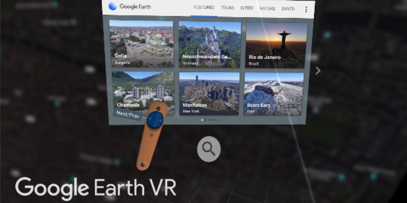
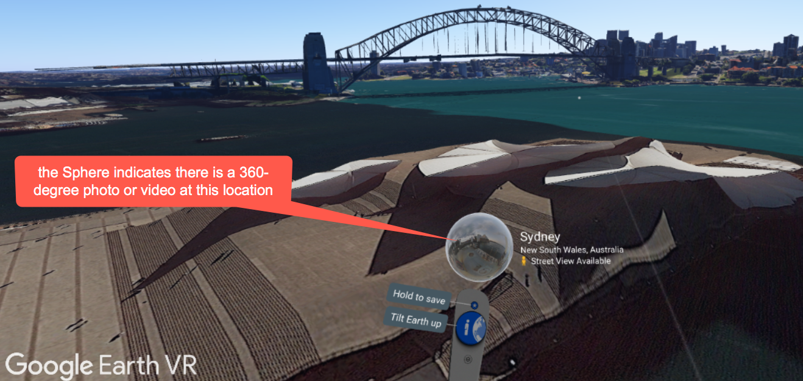
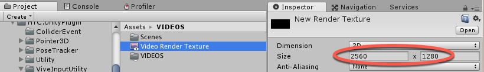
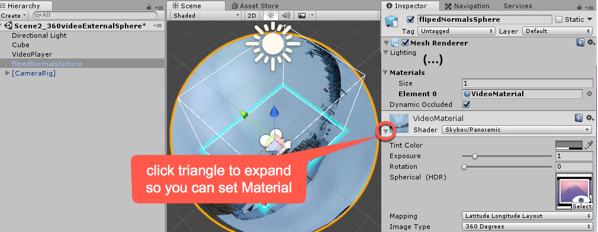
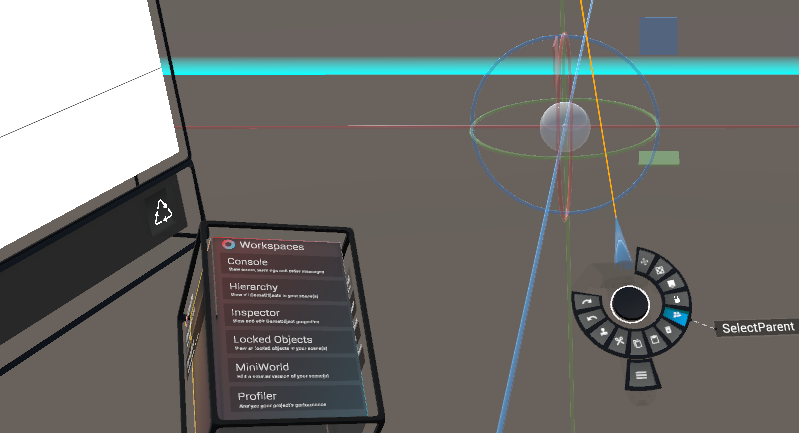
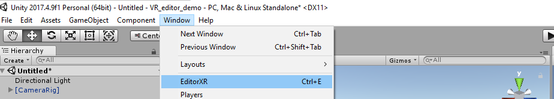
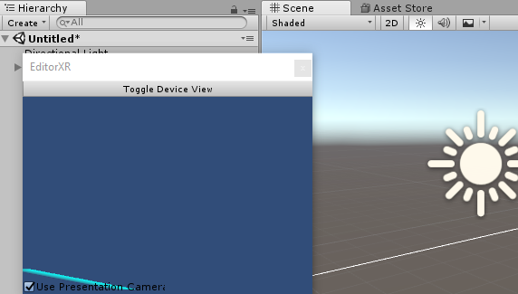
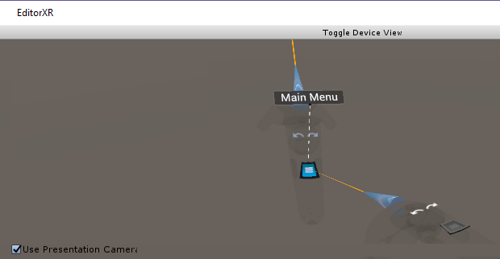
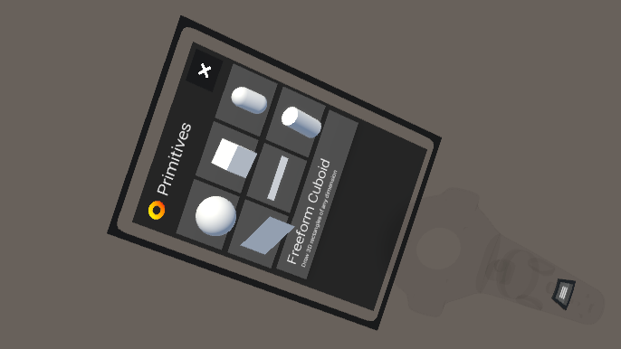

# Virtual Reality and extra features

In this chapter, we will cover:

1. UI Slider to change game quality settings
2. Pausing the game
3. Implementing slow motion
4. Gizmo to show currently selected object in Scene panel
5. Editor snap-to grid drawn by Gizmo
6. Creating a VR project
7. Adding 360-=degree videos to a VR project
8. Working with VR content inside a VR environment - the XR Editor 


<!-- ******************************* -->
<!-- ******************************* -->

# Introduction

There are too many features in Unity 2018 to all be covered in an single book. In this chapter we present a set of 
recipes illustrating VR game development in Unity, plus a range of additional Unity features that we wanted to 
include.

# The Big Picture

Virtual Reality is about presenting to the player an immersive audio-visual experience, engaging enough for them to 
lose them selves in exploring and interacting with the game world that has been created.

From one point of view, VR simply requires 2 cameras, to generate the images for each eye, to give that realistic 3D 
effect. But effective VR needs content, UI controls and tools to help create them.

In this chapter we explore recipes that work with 360-degree videos, and the Unity's XR Editor toolset.

## Gizmos

Gizmos are another kinds of Unity editor customization. Gizmos are provide visual aids to game designers in the Scene panel. They can be useful as setup aids (to help us know what we are doing), or for debugging (understanding why objects aren't behaving as expected).

Gizmos are not drawn through Editor scripts, but as part of Monobehavious - i.e. they only work for GameObjects in the current scene. Gizmo drawing is usually performed in 2 methods:

- OnDrawGizmos(): This is executed every frame, for every GameObject in the hierarchy

- OnDrawGizmosSelect(): This is executed every frame, for just the/those GameObject(s) that are currently selected in the hierarchy

Gizmo graphical drawing makes it simple to draw lines, cubes, spheres. Also more complex shapes with meshes, and also displaying 2D image icons (located in the Assets/Gizmos folder).

Several recipes in this chapter illustrate how Gizmos can be useful. Often new GameObjects created from Editor 
Extensions will have helpful Gizmos associated with them.


<!-- ******************************* -->
<!-- ******************************* -->
<!-- ******** new recipe ********** -->
<!-- ******************************* -->
<!-- ******************************* -->

# UI Slider to change game quality settings

In this recipe we show how the player can control the quality settings by providing UI Slider and reading the array of possible settings.


<!-- ******************************* -->
<!-- ******************************* -->

## Getting ready

For this recipe, we have prepared a package named BallGame containing two Scenes. The package is in the 16_01 folder.


<!-- ******************************* -->
<!-- ******************************* -->

## How to do it... 

To create a player UI to changing the game's quality settings, do the following:

1. Create a new 3D project, and import the BallGame package.
 
1. Open the Scene named scene0_ballCourt.

1. In the Scene create a new UI Panel named Panel-quality, by choosing menu: Create | UI | Panel.

1. With GameObject Panel-quality selected in the Hierarchy, create a new UI Slider named Slider-quality, by choosing menu: Create | UI | Slider. This GameObject should be childed to GameObject Panel-quality.

1. With GameObject Panel-quality selected in the Hierarchy, create a new UI Text GameObject named Text-quality, by choosing menu: Create | UI | Text. This GameObject should be childed to GameObject Panel-quality. In the Inspector set its Transform Position Y value to -25.

1. Create a new C# script-class named QualityChooser, and attach an instance-object as a component to the First-Person Controller:

    ```csharp
        using UnityEngine;
        using UnityEngine.UI;
        using System.Collections;
        
        public class QualityChooser : MonoBehaviour {
        	public GameObject panelGo;
        	public Slider slider;
        	public Text textLabel;

        	void Awake () {
        		slider.maxValue = QualitySettings.names.Length - 1;
        		slider.value = QualitySettings.GetQualityLevel();
        		SetQualitySliderActive(true);
        	}
        
        	public void SetQualitySliderActive(bool active) {
        		Cursor.visible = active;
        		panelGo.SetActive(active);
        	}
        
        	public void UpdateQuality(float sliderFloat) {
        		int qualityInt = Mathf.RoundToInt (sliderFloat);
        		QualitySettings.SetQualityLevel (qualityInt);
        		textLabel.text = QualitySettings.names [qualityInt];
        	}
        }
    ```

1. In the Hierarchy select the First Person Controller. Then, from the Inspector, access the Quality Chooser component, populate the panelGo, Slide and Text Label public fields with UI ameObjects Panel-quality, Slider and Text.
 
    

1. From the Hierarchy panel, select QualitySlider. Then, from the Inspector panel, Slider component, find the list named On Value Changed (Single), and click on the + sign 
to add a command.

1. Drag the First Person Controller from the Hierarchy into the Game Object field of the new command. Then, use the function selector to find the SetQuality function under Dynamic float (No Function > PauseGame | Dynamic float | SetQuality). 

    

1. When you play the Scene, you should be able to drag the quality slider to change the quality settings.

<!-- ******************************** -->
<!-- ******************************** -->

## How it works...

You created a panel containing a UI Slider and a UI Text object.

Method SetQualitySliderActive(...) receives a true/false value, and uses this to show/hide the mouse cursor and the UI Panel.

Method UpdateQuality(...) receives a float value, from the Slider OnChange event. This value is converted to an integer, to then be the index of the selected Quality setting. This index is used both to select the project quality setting, and also to update the UI Text label with the name of the currently selected quality setting.

When the Scene begins, in method Awake(), the UI Slide has its maximum value set to 1 less then the number of project quality items (e.g. if 5 items, the slider will be from 0 .. 4). Also the slide is moved to the position corresponding to the current quality level, and method SetQualitySliderActive(...) is invokved with value true, to display both mouse pointer and the UI Panel showing the 
slide and text label. sdf 


<!-- ******************************** -->
<!-- ******************************** -->

## There's more...

Here are some ways to go further with this recipe.

<!-- ******************************** -->
<!-- ******************************** -->

## See/Edit List of Quality Settings

You can view, and modify the quality settings avaible for a project. Choose menu: Edit | Project Settings | Quality.


<!-- ******************************* -->
<!-- ******************************* -->
<!-- ******** new recipe ********** -->
<!-- ******************************* -->
<!-- ******************************* -->

# Pausing the game

As compelling as your next game will be, you should always let players pause it for a short break. Sometimes a game pause is to let the player rest, another reason might be to change some game setting such as volume or graphics quality.

Pausing the game usually involves a combination of freezing game action, and also hiding / revealing UI items, to display a message to the player and provide UI controls to change settings.

In this recipe, we will implement a simple and effective pause screen, that hides the previous recipe's quality settings slide when the game is being played, and reveals it when the game has been paused.

<!-- ******************************* -->
<!-- ******************************* -->

## Getting ready

This recipe builds on the previous one, so make a copy of that and use that copy.

<!-- ******************************* -->
<!-- ******************************* -->

## How to do it... 

To pause your game upon pressing the Esc key, follow these steps:

1. Select the First Person Controller, and in the Inspector enable the following components:

    - Character Controller
    
    - Mouse Look (Script)
    
    - Character Motor (Script)
    
    - FPS Input Controller (Script)
    
    - Shooter (Script)


1. Add the following C# script PauseGame to First Person Controller:

    ```csharp
        using UnityEngine;
        using UnityEngine.UI;
        using System.Collections;
        
        public class PauseGame : MonoBehaviour {
        	private bool isPaused = false;
        	private QualityChooser qualityChooser;
        
        	void Start () {
        		qualityChooser = GetComponent<QualityChooser>();
        	}
        
        	void Update () {
        		if (Input.GetKeyDown(KeyCode.Escape)) {
        			isPaused = !isPaused;
        			SetPause ();
        		}
        	}
        
        	private void SetPause() {
        		float timeScale = !isPaused ? 1f : 0f;
        		Time.timeScale = timeScale;
        		GetComponent<MouseLook> ().enabled = !isPaused;
        		qualityChooser.SetQualitySliderActive(isPaused);
        	}        
        }
    ```

1. Edit the QualityController script-class, and in the Awake() method change the last line to pass false (not true) to method SetQualitySliderActive(...):

    ```csharp
        	void Awake () {
        		slider.maxValue = QualitySettings.names.Length - 1;
        		slider.value = QualitySettings.GetQualityLevel();
        		SetQualitySliderActive(false);
        	}
    ```

1. When you play the scene, you should be able to pause/resume the game by pressing the Escape key, also displaying/hiding the slider that controls the game's quality settings.


<!-- ******************************** -->
<!-- ******************************** -->

## How it works...

To pause a Unity game with a script, we need to do is set the game's Time Scale to 0 (and set it back to 1 to resume) . Method SetPause() does actions according to the value of the isPaused variable:

- isPause true: Time Scale 0 (pause the game), disable MouseLook component, and activate the quality slider and mouse cursor
 
- isPause false: Time Scale 1 (resume the game), enable MouseLook component, and de-activate the quality slider and mouse cursor


In method Update(), each frame a test is made for whether the Escape key has been pressed. If pressed, the value of 
isPaused is toggled, and method SetPause() is invoked.

<!-- ******************************** -->
<!-- ******************************** -->

## There's more...

Here are some ways to go further with this recipe.

<!-- ******************************** -->
<!-- ******************************** -->

## Learning more about QualitySettings

Our code for changing quality settings is a slight modification of the example given by Unity's documentation. If you want to learn more about the subject, check out 

- http://docs.unity3d.com/ScriptReference/QualitySettings.html.


<!-- ******************************** -->
<!-- ******************************** -->

## Offer user futher game settings

You could add more UI panels to be activated when the game is paused, for sound volume controls, save/load buttons, and so on.


<!-- ******************************* -->
<!-- ******************************* -->
<!-- ******** new recipe ********** -->
<!-- ******************************* -->
<!-- ******************************* -->

# Implementing slow motion

Since Remedy Entertainment's Max Payne, slow motion, or bullet time, became a popular feature in games. For example, Criterion's Burnout series has successfully explored the 
slow motion effect in the racing genre. In this recipe, we will implement a slow motion 
effect triggered by the pressing of the mouse's right button.

<!-- ******************************* -->
<!-- ******************************* -->

## Getting ready

For this recipe, we will use the same package as the previous recipes, BallGame in the 16_03 folder.

<!-- ******************************* -->
<!-- ******************************* -->

## How to do it... 

To implement slow motion, follow these steps:

1. Import the BallGame package into your project and, from the Project panel, open the level named scene1_ballGame.

1. Create C# script-class BulletTime, and add an instance-object as a component to the First Person Controller 
GameObject:

    ```csharp
        using UnityEngine;
        using UnityEngine.UI;
        using System.Collections;
        
        public class BulletTime : MonoBehaviour {
        	public float sloSpeed = 0.1f;
        	public float totalTime = 10f;
        	public float recoveryRate = 0.5f;
        	public Slider EnergyBar;
        	private float elapsed = 0f;
        	private bool isSlow = false;
        
        	void Update (){        
        		if (Input.GetButtonDown ("Fire2") && elapsed < totalTime)
        			SetSpeed (sloSpeed);
        		
        		if (Input.GetButtonUp ("Fire2"))
        			SetSpeed (1f);
        		
        		if (isSlow) {
        			elapsed += Time.deltaTime / sloSpeed;
        
        			if (elapsed >= totalTime)
        				SetSpeed (1f);        			
        		} else {
        			elapsed -= Time.deltaTime * recoveryRate;
        			elapsed = Mathf.Clamp (elapsed, 0, totalTime);
        		}
        
        		float remainingTime = (totalTime - elapsed) / totalTime;
        		EnergyBar.value = remainingTime;
        	}
        
        	private void SetSpeed (float speed) {
        		Time.timeScale = speed;
        		Time.fixedDeltaTime = 0.02f * speed;
                isSlow = !(speed >= 1.0f);	
        	}
        }

    ```

1. Add a UI Slider to the Scene named Slider-energy, choosing menu: Create | UI | Slider. Please note that it will be created as a child of the existing Canvas object. 

1. Select Slider-energy and, from the Rect Transform component in the Inspector, set its Anchors as follows: 

    - Min X: 0, Y: 1
    
    - Max X: 0.5, Y: 1
    
    - Pivot X: 0, Y: 1

1. Select Slider-energy and, from the Rect Transform component in the Inspector, set its position as follows: 

    - Left: 0
    
    - Pos Y: 0
    
    - Pos Z: 0
     
    - Right: 0
    
    - Height: 50
    
    

    
1. In the Inspector, set as inactive the sliders child GameObject Handle Slide Area.

    

1. Finally, select the First Person Controller from the Hierarchy, find the Bullet Time component, and drag GameObject Slider-energy from the Hierarchy into its Energy Bar slot.

1. Play your game. You should be able to activate slow motion by holding down the right mouse button (or whatever alternative you have set for Input axis Fire2). The slider will act as a progress bar that slowly shrinks, indicating the remaining bullet time you have.

<!-- ******************************** -->
<!-- ******************************** -->

## How it works...

Basically, all we need to do to have the slow motion effect is decrease the Time.timeScale variable. In our script, we do that by using the sloSpeed variable. Please note that we also need to adjust the Time.fixedDeltaTime variable, updating the physics simulation of our game.

In order to make the experience more challenging, we have also implemented a sort of energy bar to indicate how much bullet time the player has left (the initial value is given, in seconds, by the totalTime variable). Whenever the player is not using bullet time, he has his quota filled according to the recoveryRate variable.

Regarding the UI slider, we have used the Rect Transform settings to place it on the top-left corner and set its dimensions to half of the screen's width and 50 pixels tall. Also, we have hidden the handle slide area to make it similar to a traditional energy bar. Finally, instead of allowing direct interaction from the player with the slider, we have used the BulletTime script to change the slider's value.

<!-- ******************************** -->
<!-- ******************************** -->

## There's more...

Some suggestions for you to improve your slow motion effect even further are as follows.

<!-- ******************************** -->
<!-- ******************************** -->

## Customizing the slider

Don't forget that you can personalize the slider's appearance by creating your own sprites, or even by changing the slider's fill color based on the slider's value. 

Try adding the following lines of code to the end of the Update function:

```csharp
    GameObject fill = GameObject.Find("Fill").gameObject;
    Color sliderColor = 
Color.Lerp(Color.red, Color.green, remainingTime);
    fill.GetComponent<Image> ().color = sliderColor;
```


<!-- ******************************** -->
<!-- ******************************** -->

## Adding Motion Blur

Motion Blur is an image effect frequently identified with slow motion. Once attached to the camera, it could be enabled or disabled depending on the speed float value. For more information on the Motion Blur post-processing image effect, refer to:

- https://github.com/Unity-Technologies/PostProcessing/wiki/Motion-Blur

- https://docs.unity3d.com/Packages/com.unity.postprocessing@2.0/manual/Motion-Blur.html

- https://docs.unity3d.com/Packages/com.unity.postprocessing@2.0/manual/Manipulating-the-Stack.html


<!-- ******************************** -->
<!-- ******************************** -->

## Creating sonic ambience

Max Payne famously used a strong, heavy heartbeat sound as sonic ambience. You could also try lowering the sound effects volume to convey the character focus when in slow motion. Plus, using audio filters on the camera could be an interesting option.


<!-- ******************************* -->
<!-- ******************************* -->
<!-- ******** new recipe ********** -->
<!-- ******************************* -->
<!-- ******************************* -->

# Gizmo to show currently selected object in Scene panel

Gizmos are provide visual aids to game designers in the Scene panel. In this recipe we'll highlight clearly in the Scene panel, the GameObject that is currently selected in the Hierarchy.


<!-- ******************************* -->
<!-- ******************************* -->

## How to do it... 

To create a Gizmo to show the selected object in Scene panel, follow these steps:

1. Create a new 3D project.

1. Create a 3D Cube, choosing menu: Create | 3D Object | Cube.

1. Create C# script-class GizmoHighlightSelected, and add an instance-object as a component to the 3D Cube:

    ```csharp
        using UnityEngine;
        
        public class GizmoHighlightSelected : MonoBehaviour {
        	public float radius = 5.0f;
                
        	void OnDrawGizmosSelected() {
        		Gizmos.color = Color.red;
        		Gizmos.DrawWireSphere(transform.position, radius);
        
        		Gizmos.color = Color.yellow;
        		Gizmos.DrawWireSphere(transform.position, radius - 0.1f);
        
        		Gizmos.color = Color.green;
        		Gizmos.DrawWireSphere(transform.position, radius - 0.2f);
        	}
        }
    ```

1. Make lots of duplicates of the 3D Cube, distributing them randomly around the Scene.

1. When you select one Cube in the Hierarchy, you should see 3 colored wireframe spheres drawn around the selected 
GameObject in the Scene panel.


<!-- ******************************** -->
<!-- ******************************** -->

## How it works...

When an object is selected in Scene, if it contains a scripted component that has a method OnDrawGizmosSelected(), 
then that method is invoked. Our method draws 3, concentric wireframe spheres in three different colors around the 
selected object.

Gizmos Unity manual entry:

    - https://docs.unity3d.com/Manual/GizmosMenu.html

<!-- ******************************* -->
<!-- ******************************* -->
<!-- ******** new recipe ********** -->
<!-- ******************************* -->
<!-- ******************************* -->

# Editor snap-to grid drawn by Gizmo

If the positioning of objects needs to be restricted to specific increments, it is useful to have a grid drawn in the Scene panel to help ensure new objects are positioned based on those values, and also code to snap objects to that grid.

In this recipe we use Gizmos to draw a grid, with customizable grid size, color, number of lines and line lenght.


<!-- ******************************* -->
<!-- ******************************* -->

## How to do it... 

To create a Gizmo to show the selected object in Scene panel, follow these steps:

1. Create a new 3D project.

1. For the Scene panel, turn off the Skybox view (or simple toggle off all the visual settings), so you have a plain background for your grid work.

    

1. The display, and updating of child objects will be performed by a script-class GridGizmo. Create a new C# script-class named GridGizmo containing the following:

    ```csharp
        using System.Collections;
        using System.Collections.Generic;
        using UnityEngine;
        
        public class GridGizmo : MonoBehaviour {
        	[SerializeField]
            public int grid = 2;
        
        	public void SetGrid(int grid) {
        		this.grid = grid;
        		SnapAllChildren();
        	}
        
        	[SerializeField]
        	public Color gridColor = Color.red;
        
        	[SerializeField]
            public int numLines = 6;
        
        	[SerializeField]
            public int lineLength = 50;
        
        	private void SnapAllChildren() {
        		foreach (Transform child in transform)
                    SnapPositionToGrid(child);
        	}
        
        	void OnDrawGizmos() {
        		Gizmos.color = gridColor;
        
        		int min = -lineLength;
        		int max = lineLength;
        
        		int n = -1 * RoundForGrid(numLines / 2);
        		for (int i = 0; i < numLines; i++) {
        			Vector3 start = new Vector3(min, n, 0);
        			Vector3 end = new Vector3(max, n, 0); 
        			Gizmos.DrawLine(start, end);
        
        			start = new Vector3(n, min, 0);
        			end = new Vector3(n, max, 0); 
        			Gizmos.DrawLine(start, end);
        
        			n += grid;
        		}
        	}
        
        	public int RoundForGrid(int n) {
        		return (n/ grid) * grid;
        	}
        	
        	public int RoundForGrid(float n) {
        		int posInt = (int) (n / grid);
        		return posInt * grid;
        	}
        	
        	public void SnapPositionToGrid(Transform transform) {
        		transform.position = new Vector3 (
        			RoundForGrid(transform.position.x),
        			RoundForGrid(transform.position.y),
        			RoundForGrid(transform.position.z)
        		);
        	}
        }
    ```

1. Let's use an Editor script to add a new menu item to the GameObject menu. Create a folder named Editor, and in that folder create a new C# script-class named EditorGridGizmoMenuItem containing the following:
   
    ```csharp
        using UnityEngine;
        using UnityEditor;
        using System.Collections;
        
        public class EditorGridGizmoMenuItem : Editor {
        	[MenuItem("GameObject/Create New Snapgrid", false, 10000)]
        	static void CreateCustomEmptyGameObject(MenuCommand menuCommand) {
        		GameObject gameObject = new GameObject("___snap-to-grid___");
        		
        		gameObject.transform.parent = null;
        		gameObject.transform.position = Vector3.zero;
        		gameObject.AddComponent<GridGizmo>();        
        	}
        }
    ```

1. Let's now add another Editor script, for a custom Inspector display (and updater) for GridGizmo components. Also in your Editor folder create a new C# script-class named EditorGridGizmo containing the following:
   
    ```csharp
        using UnityEngine;
        using UnityEditor;
        using System.Collections;
        
        [CustomEditor(typeof(GridGizmo))]
        public class EditorGridGizmo : Editor {
        	private GridGizmo gridGizmoObject;
        	private int grid;
        	private Color gridColor;
        	private int numLines;
        	private int lineLength;
        	
        	private string[] gridSizes = {
        		"1", "2", "3", "4", "5"
        	};
        	
        	void OnEnable() {
        		gridGizmoObject = (GridGizmo)target;
        		grid = serializedObject.FindProperty("grid").intValue;
        		gridColor = serializedObject.FindProperty("gridColor").colorValue;
        		numLines = serializedObject.FindProperty("numLines").intValue;
        		lineLength = serializedObject.FindProperty("lineLength").intValue;
        	}
        		
        	public override void OnInspectorGUI() {
        		serializedObject.Update ();
        		
        		int gridIndex = grid - 1;
        		gridIndex =  EditorGUILayout.Popup("Grid size:",  gridIndex, gridSizes);        		
        		gridColor = EditorGUILayout.ColorField("Color:", gridColor);
        		numLines =  EditorGUILayout.IntField("Number of grid lines",  numLines);
        		lineLength =  EditorGUILayout.IntField("Length of grid lines",  lineLength);
        
        		grid = gridIndex + 1;
        		gridGizmoObject.SetGrid(grid);	
        		gridGizmoObject.gridColor = gridColor;
        		gridGizmoObject.numLines = numLines;	
        		gridGizmoObject.lineLength = lineLength;	
        		serializedObject.ApplyModifiedProperties ();
        		SceneView.RepaintAll();
        	}        
        }
    ```

1. Add a new GizmoGrid GameObject to the Scene, by choosing menu: GameObject | Create New Snapgrid. A new GameObject named ___snap-to-grid___ should be added to the Hierarchy.

    

1. Select GameObject ___snap-to-grid___, and modify some of its properties in the Inspector. You can change the grid size, the color of the grid lines, the number of lines and their length:

    
 

1. Create a 3D Cube, choosing menu: Create | 3D Object | Cube. Now drag the 3D Cube in the Hierarchy and child it to 
GameObject ___snap-to-grid___.


1. We now need a small script-class so that each time the GameObject is moved (in Editor mode) it asks for its position to be snapped by the parent scriped component SnapToGizmoGrid. Create C# script-class SnapToGizmoGrid, and add an instance-object as a component to the 3D Cube:

    ```csharp
        using System.Collections;
        using System.Collections.Generic;
        using UnityEngine;
        
        [ExecuteInEditMode]
        public class SnapToGridGizmo : MonoBehaviour {
            public void Update()
            {
        #if UNITY_EDITOR
                transform.parent.GetComponent<GridGizmo>().SnapPositionToGrid(transform);
        #endif
            }
            
        }
    ```

1. Make lots of duplicates of the 3D Cube, distributing them randomly around the Scene - you'll find they snap to the
 grid.

1. Select GameObject ___snap-to-grid___ again, and modify some of its properties in the Inspector. You'll see that 
the changes are instantly visible in the Scene, and that all child objects that have a scripted component of 
SnapToGizmoGrid are snapped to any new grid size changes.


<!-- ******************************** -->
<!-- ******************************** -->

## How it works...

Script-class EditorGridGizmoMenuItem adds a new item to the GameObject menu. When selected a new GameObject is added to the Hierarchy named  ___snap-to-grid___, positioned at (0,0,0) and containing an instance-object component of script-class GridGizmo.

Script-class GridGizmo draws a 2D grid based on public properties for grid size, color, number if lines and line length. Also, method SetGrid(...), as well as updating integer grid size variable grid, also invokes method SnapAllChildren(), so that each time the grid size is changed, all child GameObjects are snapped into the new grid positions.

Script-class SnapToGridGizmo includes Editor attribute `[ExecuteInEditMode]`, so that it will received Update() messages when its properties are changed at Design-Time in the Editor. Each time Update() is invoked, it calls method SnapPositionToGrid(...) in its parent GridGizmo instance-object, so that its position is snapped based on the current settings of the grid. To ensure this logic and code is not compiled into any final Build of the game, the contents of Update() are wrapped in an `#if UNITY_EDITOR` compiler test. Such content is removed before a build is compiled for the final game.

Script-class EditorGridGizmo is a custom Editor Inspector component. This allows for both control of which properties are displayed in the Inspector, how they are displayed, and it allows actions to be performed when any values are changed. So, for example, after chanfges have been saved statement `SceneView.RepaintAll()` ensures the grid is redisplayed, since it results int an OnDrawGizmos() message being sent.


<!-- ******************************* -->
<!-- ******************************* -->
<!-- ******** new recipe ********** -->
<!-- ******************************* -->
<!-- ******************************* -->

# Creating a VR project

In this recipe we go through the steps to setup a basic VR Scene in Unity using the Vive VR headset on a Windows 
computer.

<!-- ******************************* -->
<!-- ******************************* -->

## Getting ready

You need Steam VR with the Standing Only or Room-scale setup. If you have not done so yet, then follow these 
steps to setup your Vive headset ready for Unity game development :

1. Install Steam.

1. Install Steam VR.

1. Plug in your Vive headset.

1. From Steam application window run Steam VR (click VR at top right of Steam app window).

    

1. Steam VR should then run, and choose the Run Room Setup menu item.

    

1. Position your Light Houses to cover the space in the room tht you want to use.

1. From Room Setup screen, choose your room setup: Standing Only or Room-Scale:

    - Standing Only:
    
        - use headset to set center
        
        - use headset to locate floor
    
    - Room-Scale:
    
        - position your Light Houses  to cover the space you want to use
        
        - calibrate floor - putting hand controllers on the floor
        
        - walk around room, using hand controllers with trigger to trace the space you can safely move around
        
        
1. You can now explore Steam VR Home.

<!-- ******************************* -->
<!-- ******************************* -->

## How to do it... 

To create a basic VR Unity project, follow these steps:

1. Start new 3D Project.

NOTE: Either work with a new 3D Unity project, or make a backup of any project to which you are about to add VR features, since you will be adding a package that makes changes to many settings, and it could mess up settings in an existing project.

1. Delete the Main Camera from the Scene.

1. Display the Unity Player settings in the Inspector, by choosing menu: Edit | Project Settings | Player.

1. Check the Virtual Reality Support option near the bottom of Inspector:

    

1. Ensure you are logged into your Unity Account (before accessing the Asset Store)

1. Visit the Asset Store search for Steam VR from Valve Corporation

    

1. Download and Import the package (you'll be warned about having made a backup before importing ...).

1. Choose your preferred options from any popup about builds:

     

1. Drag into the Scene a clone of the [CameraRig] prefab from folder: Project | SteamVR | Prefabs. You'll see a 3D 
space representing your room setup (our examples show the rectangular-based space from Standing only room setup).

    

1. Run the Scene, put on your VR headset, and ick up your hand controllers. You should see 3D representations of the position, and trigger settings etc. of your hard controllers in the virtual space.

1. Import/Create 3D Objects in your Scene - for example add a 3D Cube to the Scene, inside the room space of the CameraRig. 
  
1. Run the Scene, and try moving a virtual hand controller to collide with your 3D Cube.
  
     

1. Test physics - add a Rigid Body to the Cube (turn off gravity), add/make smaller the Box Collider to the Right controller.

1. Run the Scene - you should be able to push the Cube with teh virtual hand controller.


<!-- ******************************** -->
<!-- ******************************** -->

## How it works...

You've learnt to setup the Vive and locate and install the Steam VR package.

This package contains prefabs for the headset and handsets etc. to work in the standing/room space you setup.

You created a Unity project with the Vive prefabs. You added a 3D Cube to the Scene, and interacted with it, by adding colliders to the Cube and a hand controller GameObject.

NOTE: This was tested with Unity 2017.4.9 LTS, since it wasn't fully working with a 2018 version at the time of writing.

<!-- ******************************** -->
<!-- ******************************** -->

## There's more...

Here are some suggestions for taking this recipe further.


<!-- ******************************** -->
<!-- ******************************** -->

## Exploring free VR/XR samples/tutorials

Some good sources of free sample VR projects to explore include:

    - Unity Technologies VR Samples:
    
        - https://assetstore.unity.com/packages/essentials/tutorial-projects/vr-samples-51519
        


    - a good tutorial on Vive and Unity from Ray Wenderlick

        - https://www.raywenderlich.com/792-htc-vive-tutorial-for-unity
        
    - Valve Lab Renderer on the Unity Asset store:
    
        - https://assetstore.unity.com/packages/tools/the-lab-renderer-63141
    
    - Vive input utility on the Unity Asset store:
        
        - https://assetstore.unity.com/packages/tools/integration/vive-input-utility-64219


<!-- ******************************** -->
<!-- ******************************** -->

## Setup with Occulus Rift

The Occulus Rift setup is similar to that with teh Vive, although it actually integrates a little better with Unity. You need to :

1. Install the Occulus runtime
    
1. Setup for room / standing - for the Infrared Cameras

1. There is no need download any package, and no need to remove the Main Camera.

Learn more at the Occulus Rift Unity documentation site:

    - https://developer.oculus.com/documentation/unity/latest/concepts/book-unity-gsg/

<!-- ******************************** -->
<!-- ******************************** -->

## Use Single Pass if working with Lightweight Rendering Pipeline

If using new lightweight rendering pipelines - need to choose Single Pass when setting up XR in the settings, having chosen menu: Edit | Project Settings | Player.


<!-- ******************************* -->
<!-- ******************************* -->
<!-- ******** new recipe ********** -->
<!-- ******************************* -->
<!-- ******************************* -->

# Adding 360-degree videos to a VR project

Google Earth VR is great fun:



Affordable 360-degree cameras mean that it's easy to create your own, or find free online 360-degree image and video clips. In this recipe we'll learn how to add a 360-degree video clip as a skybox in a VR project. Also how the 360-degree video clips can be played on the surface of 3D objects, including the inside of a sphere - a bit like Google Earth VR mode when you raise the sphere to your head to view its 360-degree image contents.





<!-- ******************************* -->
<!-- ******************************* -->

## Getting ready

For this recipe we have provided a short Snowboarding_Polar.mp4 in the 16_07 folder. This project builds on the previous one (i.e. a basic VR project), so make a copy of that and work on the copy.

NOTE: Special thanks to Kris Szczurowski for permission to use his snowboarding video, and all the help with these VR project recipes.

<!-- ******************************* -->
<!-- ******************************* -->

## How to do it... 

To add 360 videos to a VR project, follow these steps:

1. Import your 360-degree polar format video clip into your Unity project (e.g. Snowboarding_Polar.mp4).

1. Select the video asset in the Project panel, and in the Inspector make a note of its resolution (we'll need those 
later) (e.g. 2560 x 1280):

    

1. Create a new empty GameObject named video-player, choose menu: Create | Empty.

1. Select video-player in the Hierarchy, and in the Inspector add a component Video Player component, by choosing: Add Component | Video | Video Player.

1. From the Project panel drag your video asset file, e.g. Snowboarding_Polar, into the Video Clip property of the Video Player component.

1. Create new Render Texture asset file named VideoRenderTexture, by choosing menu: Create | Render Texture.

1. Set the Resolution of the VideoRenderTexture to match the video asset resolution. e.g. 2560 x 1280:

    

1. In the Hierarchy select GameObject video-player, and for the Video Player component set target texture to be VideoRenderTexture.

1. Create a new Material named video_m, by choosing menu: Create | Material.

1. With video_m selected in the Project panel, change its shader to Skybox | Panoramic.

    
    
1. In the Inspector, for the Spherical HRD property, click the Select button and choose Texture VideoRenderTexture.    

    

1. Open the Lighting Settings panel, choose menu: Window | Rendering | Lighting Settings. In the Inspector set the Skybox material to video_m.
    
    

1. Play the Scene, put on you VR headset, and you should see the 360-degree video playing all around you.

<!-- ******************************** -->
<!-- ******************************** -->

## How it works...

You created a GameObject with a Video Player component, and make it play your 360-degree video. You made this component render to a Render Texture of the same dimensions as your video.

You created a skybox-panomaric Materials, and selected your Render Texture as the Texture for this Material. You then set this Material as the Skybox for the Lighting Settings.

NOTE: This was tested with Unity 2017.4.9 LTS, since it wasn't fully working with a 2018 version at the time of writing.

<!-- ******************************** -->
<!-- ******************************** -->

## There's more...

Here are some suggestions for taking this recipe further.

<!-- ******************************** -->
<!-- ******************************** -->

## Play 360-degree Video on surface of a 3D Object

To play 360-degree videos on the surface of a 3D object, do the above steps, but do not set the Skybox to video_m. 
Instead set the Material of the Mesh Rendered component of your 3D object to video_m:

    

This works for 3D objects with inverted normals - e.g. a hollow 3D Sphere that you can look at from the inside.


<!-- ******************************* -->
<!-- ******************************* -->
<!-- ******** new recipe ********** -->
<!-- ******************************* -->
<!-- ******************************* -->

# Working with VR content inside a VR environment - the XR Editor 

An exciting project from Unity is the XR-Editor, which is a VR environment that allows you to edit a Scene in VR. The project provides great examples of VR UI elements, including 3D menus and laser pointer selectors etc. It allows you to see Console reports in the environment and interact with the Hierarchy of GameObjects.



In this recipe we set up the XR-Editor for use in a Unity project.

## Getting ready

Start this recipe with a copy of the Basic VR project created in the recipe before the previous one.

# How to do it ...

1. Install the TextMeshPro package, choosing menu: Window | Package Manager, and selecting Text Mesh Pro.

1. Download the Editor XR package from the link on the Unity blog page
    
    - http://rebrand.ly/EditorVR-package
    
    - https://blogs.unity3d.com/2016/12/15/editorvr-experimental-build-available-today/

1. Import the EditorXR-package package into your project.

1. Agree to the prompt on screen about patching the Input Manager settings:

    

1. Should have a new item on the Window Menu, Window | EditorXR.

    

1. A new, floating EditorVFR application window should appear:

    

1. Put on your VR headset and away you go. Do NOT run the Scene - EditorXR works at Design-Time, not Run-Time, so do NOT play the Scene.

1. You display the main menu by directing the laser pointer of one virutal hand controller ontothe menu bar on the other hand conrtoller.

    

1. You'll then get a cube-like, multi-sided, rotatable main menu, from which you can choose items with the laser 
pointer. For example on the Workspaces side of the menu object you can display the Console or Hierarchy panels.

    

1. You can choose the Primatives menu, from which to create new 3D objects.

    

1. With a GameObject selected, a wheel-menu offers actions, such as deleting, or selecting the parent and so on.

    

<!-- ******************************** -->
<!-- ******************************** -->

## How it works...

In this recipe you learned how to install and start interacting with Unity's Editor-XR. 

NOTE: This was tested with Unity 2017.4.9 LTS, since it wasn't fully working with a 2018 version at the time of writing.

Learn more about Editor VR at the Unity blog:

- https://blogs.unity3d.com/2016/12/15/editorvr-experimental-build-available-today/


